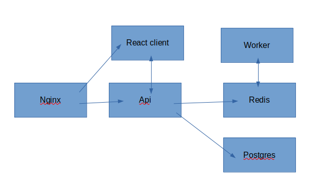

# zad1

## Aplikacja na bazie lab9.

## Modyfikacje
- podpiecie plikow js do odpowiednich sciezek, tworzenie zalznosci
- dodanie histori wprowadzanych indexow
- utworzenie dokumentacji

## Architektura


## Uruchomienie
W katalogu głównym repozytorium można uruchomić usługę poleceniem:

```
docker compose -f docker-compose.dev.yml up --build

```
 - Uruchom http://localhost:3050

